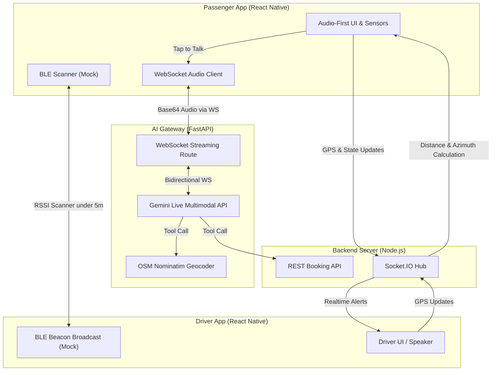

# RideNow - Smart Mobility Solution for Visually Impaired Passengers

RideNow is an accessibility-focused smart mobility layer designed to bridge the **"Last-Meter Gap"**—the final, highly visual steps of locating and boarding a ride-hailing vehicle. The system integrates hardware features (BLE, Haptics, Flash, Sensors) with real-time Multimodal Voice AI to provide an audio-first experience for visually impaired passengers and seamless guidance for drivers.

---

## 1. 🚨 Problem Statement
**How might we bridge this last-meter gap between ride-hailing drivers and visually impaired people, at any pickup point?**

Visually impaired people in urban environments rely heavily on ride-hailing services for independent travel. However, the current UX is designed entirely for sighted users:
* **The Last-Meter Gap:** Once the driver arrives at a busy pickup spot, passengers cannot see license plates, vehicle color, or driver gestures.
* **Driver Restrictions:** Drivers cannot easily interact with apps while riding/driving, which prevents continuous voice guidance.
* **Loss of Autonomy:** Passengers are forced to ask strangers to find their driver, sacrificing independence and safety.
* **No Accessibility Modes:** Existing platforms lack a dedicated accessibility mode that resolves this gap.

---

## 2. 💡 Solution Overview & Features
RideNow solves this by establishing a synchronized system of three core technical mechanisms:

### 2.1 AI Voice Agent (Hands-Free Booking)
* **Audio-First Interface:** The mobile screen acts as a giant interactive surface.
* **Conversational AI:** Tapping the screen opens a low-latency WebSocket audio stream with a **Gemini Multimodal Live Agent**. The AI listens, captures destination inputs, and queries routing options.
* **Double-Tap to Confirm:** The AI confirms the detailed address (e.g., "Chợ Bến Thành, Quận 1"). The user double-taps to confirm the booking or single-taps to cancel.

### 2.2 Proximity Guidance (Haptic Radar + Flash Beacon)
* **Azimuth Audio Navigation:** At <100m, the app reads out relative directions (e.g., *"Tài xế đang ở hướng 12 giờ, cách 80 mét"*) updated dynamically.
* **Haptic Radar:** At <20m, the passenger's phone vibrates in frequency pulses relative to distance (pulses speed up as the vehicle approaches).
* **Flash Beacon:** Simultaneously, the passenger's phone camera flash blinks, allowing the driver to spot the correct passenger in a crowd.
* **Driver Alerts:** The driver app plays audio alerts over the external speaker to guide them to the passenger.

### 2.3 Secure Authentication (BLE Handshake)
* **BLE Verification:** When the driver is within <5m, the passenger app scans the driver's BLE beacon (mocked/simulated in this MVP) and automatically authenticates the ride.
* **Safety Confirmation:** The system speaks: *"Đã xác thực tài xế an toàn qua Bluetooth"* to ensure the passenger boards the correct vehicle securely.

---

## 3. 🏗️ Tech Stack & Architecture Notes

### Tech Stack
* **Frontend (Mobile App):** React Native, Expo, React Navigation, Expo AV (Audio), Expo Sensors, Expo Camera (Flash), Expo Haptics.
* **Backend Server:** Node.js, Express, Socket.IO (WebSocket for real-time driver-rider synchronization).
* **AI Gateway:** Python, FastAPI, WebSockets, Google Gemini Live Multimodal API (for real-time voice streaming), Nominatim (Geocoding).

### Architecture Notes
1. **AI Flow:** `Mobile App (Audio Stream)` <-> `AI Gateway (FastAPI)` <-> `Gemini Live API`. The AI Gateway acts as a secure middleware to inject context (GPS, language) and execute tools (Geocoding, Booking API).
2. **Real-time Sync:** `Mobile App` <-> `Backend Server (Socket.IO)`. Driver's GPS updates are pushed to the rider for azimuth/distance calculations and haptic radar triggering.

### System Architecture Diagram

<p align="center">
  
</p>

---

## 4. 🛠️ Prerequisites & Installation Steps

### Prerequisites
1. **Node.js** (v18 or higher)
2. **Python** (v3.10 or higher)
3. **Expo CLI** (`npm install -g eas-cli`)
4. **Android/iOS Device** with Expo Go installed (highly recommended for testing).

### Step-by-Step Installation
Clone the repository and install dependencies for each service:

```bash
# 1. Setup Backend Server
cd backend-server
npm install
cp .env.example .env

# 2. Setup AI Gateway
cd ../ai-gateway
python -m venv venv
# Linux/macOS: source venv/bin/activate
# Windows: .\venv\Scripts\activate
pip install -r requirements.txt
cp .env.example .env

# 3. Setup Mobile App
cd ../mobile-app
npm install
cp .env.example .env
```

---

## 5. 🚀 Run Instructions (Local/Cloud)

### 1. Start the Backend Server (Port 5000)
```bash
cd backend-server
npm run dev
```

### 2. Start the AI Gateway (Port 8000)
Make sure your Gemini API key (`GEMINI_API_KEY`) is configured in `ai-gateway/.env`.
```bash
cd ai-gateway
# Ensure your Python venv is activated!
uvicorn app.main:app --host 0.0.0.0 --port 8000 --reload
```

### 3. Start the React Native Bundler
Ensure your machine's IP address or ngrok URLs are configured in `mobile-app/.env` (`EXPO_PUBLIC_BACKEND_URL`, `EXPO_PUBLIC_AI_GATEWAY_WS_URL`).
```bash
cd mobile-app
npx expo start --clear
```
* **To run on a physical device:** Scan the QR code with **Expo Go** (Make sure your phone and computer are on the same Wi-Fi network, or use `--tunnel`).
* **To build an installable APK:** Run `eas build --profile preview --platform android`

---

## 6. 📱 User Guide (How to use the product)

<p align="center">
  
  &nbsp;&nbsp;&nbsp;&nbsp;
  
</p>

### Phase 1: Booking a Ride (Passenger)
1. Open the RideNow app and select the **Hành khách (Rider)** mode.
2. **Tap the screen once** to activate the AI Voice Assistant.
3. Speak your destination clearly: *"Đặt xe đến Chợ Bến Thành"*.
4. The AI will process your voice, locate the detailed address, and reply: *"Có phải bạn muốn đi đến: Chợ Bến Thành, Quận 1 không? Hãy chạm nhanh hai lần vào màn hình để xác nhận."*
5. **Double-tap the screen** to confirm. The ride is booked!

### Phase 2: Approach & Proximity Guidance
1. Open a second device (or emulator) on the **Tài xế (Driver)** mode and accept the incoming ride request.
2. **Driver:** Tap "Bắt đầu di chuyển" (Start moving). You can also use the "Seed Movement Data" button to simulate moving toward the passenger for testing purposes.
3. **Passenger App:** As the driver gets closer:
   - **Audio:** Reads out directions: *"Tài xế đang ở hướng 12 giờ, cách 80 mét"*.
   - **Haptic Radar:** Phone vibrates faster as distance decreases (<20m).
   - **Flash Beacon:** Camera flash blinks to alert the driver visually.

### Phase 3: BLE Handshake & Safe Boarding
1. As the driver reaches **<5m** distance, the Passenger app detects the proximity signal (BLE/GPS fallback threshold).
2. The Passenger app automatically announces: *"Đã xác thực tài xế an toàn qua Bluetooth."*
3. The passenger can confidently board the correct vehicle.
